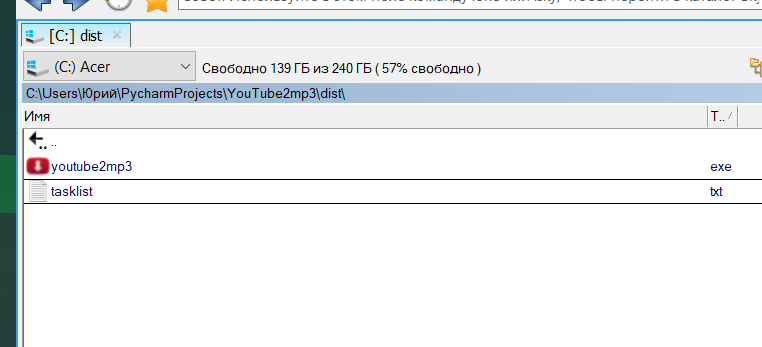

# YouTube to mp3 download and convert
Simple Python script to download youtube videos and playlists to mp3 format.
Script based on `youtube-dl` [module](https://github.com/ytdl-org/youtube-dl), and also uses `eyed3` module to add id3 tags.

## Features
* Simplified names of mp3 files 
* Special symbols is removed
* Embedded thumbnails
* Added id3 tags with authors and descriptions

## Using
* You need install [ffmpeg](https://www.ffmpeg.org/) to script be able to convert files into mp3.
* Add links to `tasklist.txt`. It can be both videos and playlists.
* Run script.

## In Windows
You can use `exe` file in `dist` folder - no need to install Python interpreter.

## Result in audiopleer

